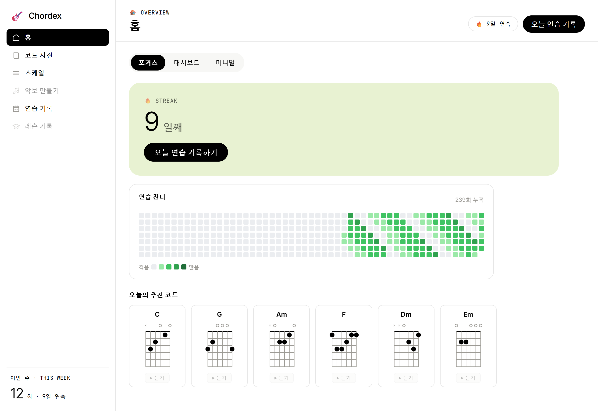
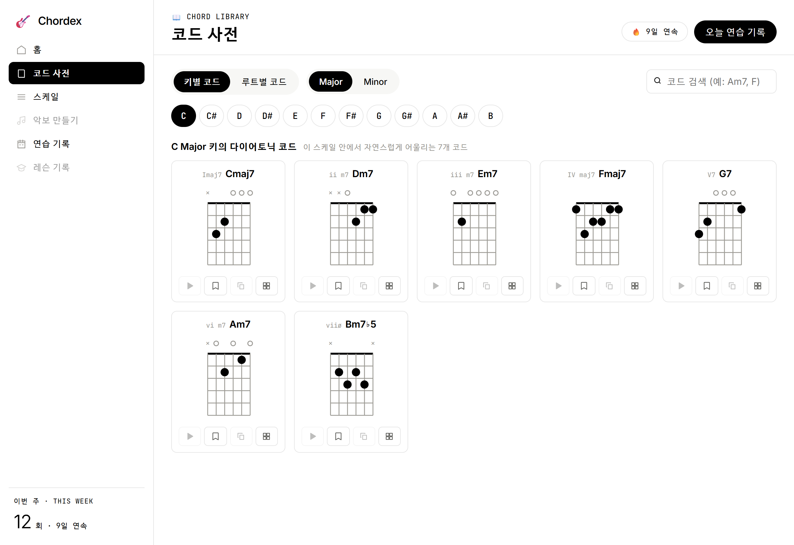
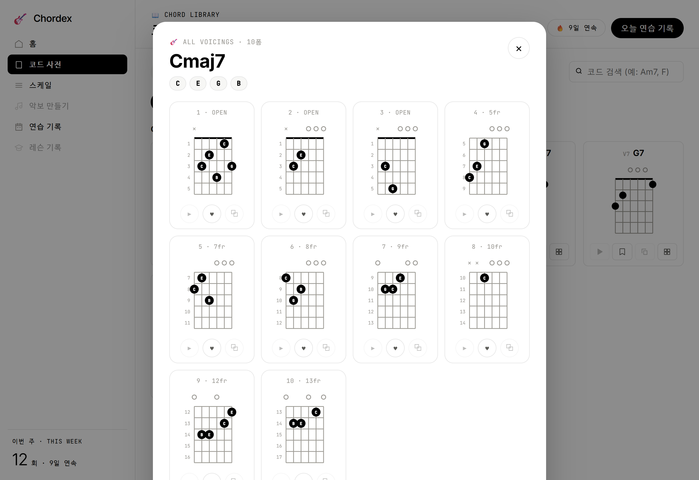
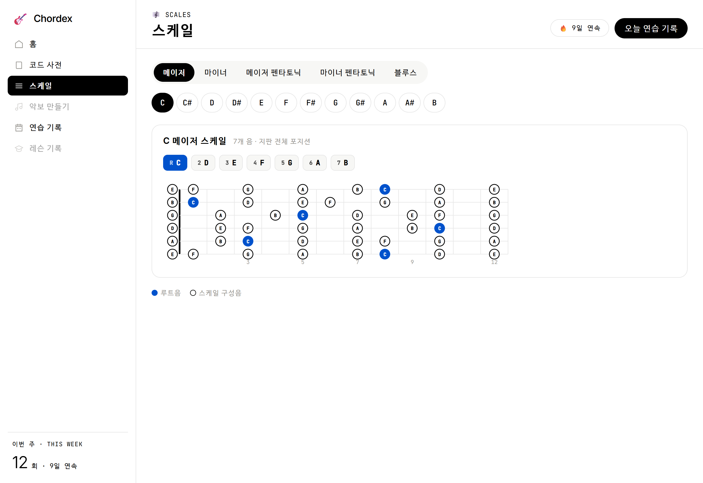
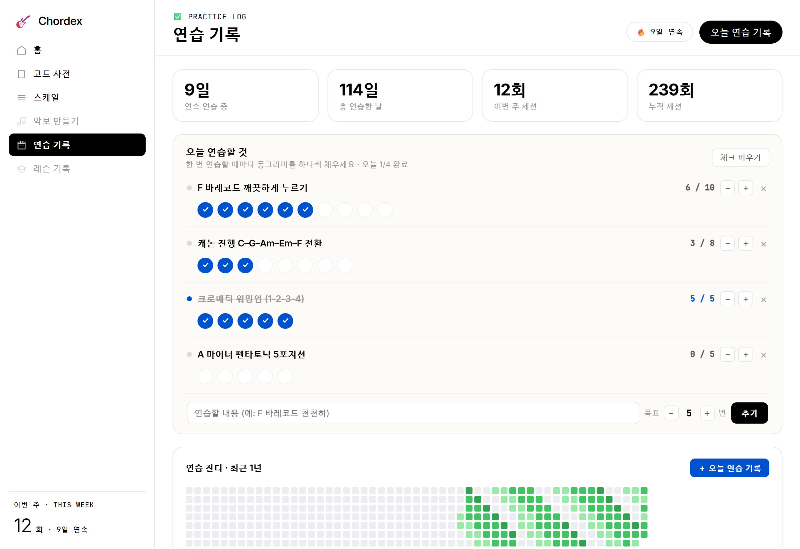

<div align="center">

# 🎸 Chordex

**기타 코드·스케일 사전 + 연습 습관 트래커**

정확한 코드 운지와 보이싱을 찾아보고, 연습을 잔디로 기록하는 기타 연습 웹앱 — 웹 · iOS · Android

<br>


</div>

<br>

### 이게 뭔가요

**Chordex**(구 코드살롱)는 기타를 연습하는 사람을 위한 **코드/스케일 사전 + 연습 기록** 앱입니다.

코드 이름만 알아도 **정확한 운지 다이어그램**과 **여러 보이싱(모든 폼)** 을 바로 볼 수 있고, 스케일을 지판 위에서 눈으로 익힐 수 있습니다. 그리고 매일의 연습을 **잔디 히트맵·드릴 체크·연습 일지**로 기록해, "오늘도 잡았다"는 감각을 이어가게 합니다.

웹앱 하나를 그대로 **iOS/Android 앱**(Capacitor)으로 감싸 어디서든 쓰고, 로그인하면 기록이 **기기 간에 동기화**됩니다.

### 미리보기

한 앱에서 코드·스케일·연습까지 — 로그인 없이도 바로 써볼 수 있습니다.



<table>
  <tr>
    <td width="50%" valign="top">
      <br>
      <b>코드 사전</b> — 키별 다이어토닉 7코드 / 루트별 전환. 각 코드의 정확한 운지 다이어그램.
    </td>
    <td width="50%" valign="top">
      <br>
      <b>모든 폼</b> — 오픈부터 하이 포지션까지, 음악적으로 타당한 보이싱을 자동 생성.
    </td>
  </tr>
  <tr>
    <td width="50%" valign="top">
      <br>
      <b>스케일</b> — 메이저·마이너·펜타토닉·블루스를 지판 위 루트 강조로 시각화.
    </td>
    <td width="50%" valign="top">
      <br>
      <b>연습 기록</b> — 드릴 체크 · 1년 잔디 히트맵 · 연속/누적 통계.
    </td>
  </tr>
</table>

### 왜 만들었나

기타 레슨을 받으며 연습하다 보니, 정작 **연습에 필요한 기능을 한곳에 모아둔 앱이 없었습니다.** 코드 사전, 보이싱, 스케일, 연습 기록 — 필요한 도구는 여기저기 흩어져 있었고, 앱마다 되는 게 다 달라서 여러 개를 오가야 했죠. 그래서 **이걸 전부 담은 올인원 기타 코드 사전 & 연습 서비스**를 직접 만들기로 했습니다.

그래서 만들 때 이런 원칙을 지켰습니다.

- **음악적으로 정확한 코드/보이싱이 먼저다.** 코드 다이어그램·보이싱 생성·지판 기하는 전부 순수 도메인 함수로 구현하고 **골든 테스트**로 지킵니다. 그럴듯한 운지가 아니라 실제로 잡을 수 있는 운지를 목표로 합니다.
- **연습은 습관이다.** GitHub 잔디식 히트맵과 스트릭으로, 실력보다 **꾸준함**을 시각화합니다.
- **로컬 우선, 그다음 클라우드.** 로그인 없이도 `localStorage`로 완전히 동작하고, 계정을 붙이면 백업·동기화가 얹힙니다(오프라인에서도 끊기지 않게).
- **웹 한 벌로 모바일까지.** 별도 네이티브 코드 대신 Capacitor로 웹 자산을 그대로 래핑합니다.

### 주요 기능

- **코드 사전** — 키별(다이어토닉 7코드, 로마숫자 표기) / 루트별(트라이어드·세븐스·나인스 등 그룹) 전환, 12음 루트 선택, 이름 검색. 총 58종 코드 퀄리티.
- **코드 다이어그램 (SVG)** — 6현 지판, 프렛/너트, 뮤트(×)·오픈(○) 마커, 운지 점, 시작 프렛 번호를 직접 렌더링.
- **"모든 폼" 보이싱** — 한 코드의 여러 보이싱을 생성해(우선순위: 오픈코드 → 바레 → 폴백) 다이어그램 그리드 + 구성음으로 제시.
- **스케일** — 메이저 / 마이너 / 메이저펜타 / 마이너펜타 / 블루스를 지판 12프렛 위에 루트 강조로 시각화.
- **연습 기록** — 통계 카드(연속·총일수·이번주·누적), 목표 횟수 드릴 체크리스트, 1년 잔디 히트맵, 연습 일지. 드릴 달성·일지 작성 시 잔디 +1.
- **계정·동기화** — Supabase 로그인(Google · Apple · 이메일 매직링크) + **오프라인 우선 동기화**(오프라인 큐 · 충돌 머지 · 로컬→클라우드 마이그레이션)로 기기 간 백업/동기화. 모바일은 네이티브 시트 로그인·딥링크 콜백까지.

### 기술 스택

| 영역 | 사용 기술 |
|------|-----------|
| 프런트엔드 | React 18 · TypeScript(strict) · Vite 5 |
| 스타일 | CSS Modules + 디자인 토큰(`tokens.css`) — 추가 UI 런타임 의존성 없음 |
| 테스트 | Vitest 2 · Testing Library (도메인 로직 TDD) |
| 모바일 | Capacitor 8 (iOS · Android 래핑) |
| 백엔드 | Supabase (Postgres · Auth · RLS 행 단위 격리) |

### 아키텍처

계층과 관심사를 엄격히 분리합니다 — **UI는 코드/보이싱/스케일 계산을 직접 하지 않고** 도메인 함수의 결과만 소비합니다.

```
src/
  domain/       # 순수 함수 (React 무의존) — 코드/보이싱/다이어그램 기하/스케일/통계. 테스트 1급 대상
  components/   # 재사용 UI (다이어그램, 지판, 카드, 잔디 등)
  views/        # 화면 (홈 · 코드사전 · 스케일 · 연습기록)
  state/        # reducer(순수) + Context + Repository(local / supabase / sync)
  auth/         # 세션 게이트 (AuthProvider · AuthGate · LoginScreen)
  lib/          # Supabase 클라이언트
  i18n/         # 문자열 (현재 한국어)
supabase/       # SQL 마이그레이션 (스키마 + RLS)
```

- **도메인 우선**: 원본 알고리즘/기하/상수를 수치 그대로 이식하고 단위 테스트로 고정.
- **Repository 추상화**: 영속화를 인터페이스 뒤로 숨겨 `localStorage` ↔ Supabase ↔ 오프라인 동기화 구현체를 교체 가능하게 설계.
- **보안**: 모든 테이블에 RLS(Row Level Security)를 걸어 "본인 행만" 접근. 클라이언트에는 공개용 anon 키만 노출(`service_role` 키·`.env`는 커밋 금지).

### 시작하기

요구사항: **Node 20+**, npm.

```bash
npm install       # 의존성 설치
npm run dev       # 개발 서버 (http://localhost:5173)
npm run build     # 타입체크(tsc -b) + 프로덕션 빌드
npm test          # 단위 테스트 (vitest run)
```

백엔드(로그인·동기화) 없이도 앱은 **로컬 모드**로 완전히 동작합니다. 계정 기능을 켜려면 Supabase 값을 환경변수로 넣습니다.

```bash
cp .env.example .env
# .env 에 아래 두 값을 채웁니다 (공개용 키만!)
#   VITE_SUPABASE_URL=https://<project-ref>.supabase.co
#   VITE_SUPABASE_ANON_KEY=<anon / publishable key>
```

> `.env`는 커밋되지 않습니다(`.env.example`만 추적). **`service_role`(secret) 키는 클라이언트/깃에 절대 넣지 마세요** — 데이터 격리는 RLS가 담당합니다. 스키마는 `supabase/migrations/0001_init.sql`을 Supabase SQL Editor에 적용하면 됩니다.

### 모바일 (Capacitor)

```bash
npm run cap:sync        # 웹 빌드 → 네이티브 프로젝트 동기화
npm run cap:android     # 빌드 + 동기화 + Android Studio 열기
```

- appId: `com.chordsalon.app`, 웹 자산 디렉터리: `dist`
- iOS 빌드는 Mac + Xcode가 필요합니다.

### 로드맵

- [x] MVP 웹앱 (코드 사전 · 스케일 · 연습 기록)
- [x] 리브랜드 + 앱 아이콘, Android 플랫폼
- [x] Supabase 클라이언트 · DB 스키마 + RLS
- [x] **웹 인증 게이트** (Google · Apple · 이메일 매직링크)
- [x] **동기화 엔진** (오프라인 큐 · 충돌 머지 · 로컬→클라우드 마이그레이션)
- [x] **네이티브 인증** (Capacitor 딥링크 · `signInWithIdToken` / Sign in with Apple) — 프로바이더 콘솔 설정 후 실기기 활성화
- [ ] 악보 빌더 · 오디오 재생 · 영어(EN) 지원

### 상태

개인 학습/제품화 프로젝트로 **활발히 개발 중**입니다. 웹 MVP + 백엔드(계정·동기화·네이티브 인증)까지 **구현 완료** — 모바일 실기기 출시를 위한 프로바이더 콘솔 설정 단계.

<div align="center">
<br>

**멋진 기타 플레이어가 되는 그날까지! 🎸**

</div>
