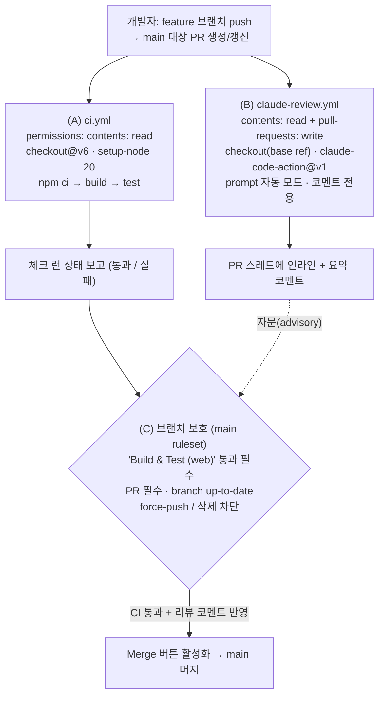
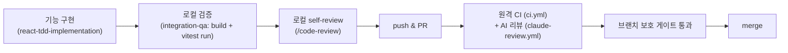

### 08 · 리뷰 자동화 (Review Automation) — guitar-chordex (코드살롱)

> 작성일: 2026-06-24
> 대상 저장소: `guitar-chordex` (private)
> 산출물: `.github/workflows/ci.yml`, `.github/workflows/claude-review.yml`, 본 설계 문서

이 문서는 모든 PR을 자동으로 검증/리뷰하는 시스템의 설계, 운영 방법, 그리고
사용자가 직접 수행해야 하는 설정을 정리한다.


#### 1. 시스템 개요 (How it works)

리뷰 자동화는 **3개의 독립 계층**으로 구성된다. 각 계층은 서로 다른 실패를
잡아내며, 권한이 분리되어 있어 한 계층이 침해돼도 다른 계층을 오염시키지 않는다.

| 계층 | 파일 / 위치 | 트리거 | 권한 | 역할 |
|------|------------|--------|------|------|
| (A) CI 게이트 | `.github/workflows/ci.yml` | PR→main, push→main | `contents: read` | `npm ci → npm run build → npm test`. 빌드/타입/테스트가 깨지면 머지 차단. |
| (B) AI 코드 리뷰 | `.github/workflows/claude-review.yml` | 모든 PR→main | `contents: read`, `pull-requests: write` | Claude가 diff를 읽고 버그/보안/도메인 순수성/규칙 위반을 인라인 코멘트로 지적. |
| (C) 브랜치 보호 | GitHub 저장소 설정 (UI) | 머지 시점 | — | (A) CI 체크 통과를 **필수**로 강제. main 직접 push/force-push 차단. |

핵심 설계 원칙:

- **권한 분리 (least privilege).** CI 잡은 `contents: read`만 가진다. 악성
  의존성이 `npm ci`/빌드 중 실행돼도 읽기만 가능하며, 코멘트 작성이나 push는
  불가능하다. 리뷰 잡만 `pull-requests: write`를 가진다. 두 관심사를 **별도
  워크플로 파일**로 분리한 이유다.
- **자문(comment-only) 리뷰 — `track_progress` 미사용.** 리뷰 잡은
  `track_progress: true`를 **설정하지 않는다.** 이 옵션은 "tag 모드"를 강제하고,
  tag 모드는 `--allowedTools` 화이트리스트로 제한할 수 없는 ~18개의 쓰기 도구
  (Edit/Write/`Bash(git add/commit/push)` 등)를 무조건 주입한다. 이는 read-only
  의도와 `contents: read` 권한에 정면으로 배치된다. `prompt`만 제공하면 액션은
  자동 모드로 동작하여 코멘트만 남기고 쓰기 도구는 주입하지 않는다.
- **안전한 트리거.** 리뷰 워크플로는 `pull_request`(NOT `pull_request_target`)를
  사용한다. fork PR은 읽기 전용 토큰으로 실행되고 시크릿에 접근할 수 없어
  `ANTHROPIC_API_KEY` 유출이 구조적으로 불가능하다.
- **베이스 ref만 체크아웃.** 리뷰 잡은 `ref:` 없이 체크아웃하여 신뢰할 수 없는
  fork head 코드가 시크릿이 살아있는 워크스페이스 루트에 들어오지 않게 한다.
  (보안 문서 원문: *"Do not check out an untrusted ref into the workspace root
  before this action."*)
- **자동 모드.** 리뷰 워크플로는 `prompt`를 제공하므로 `@claude` 멘션 없이 PR이
  열리거나 갱신될 때 즉시 리뷰한다 (automation mode auto-detected).


#### 2. PR 흐름도 (PR flow)



참고: AI 리뷰(B)는 기본적으로 **자문(advisory)** 체크다 — 코멘트만 남기고 잡은
성공으로 끝난다. 따라서 머지를 막는 강제 게이트는 (A) CI다. 리뷰 잡을 실제로
실패시키도록 구성하지 않는 한 (C)의 필수 체크에는 (A)만 등록한다.


#### 3. 사용자 설정 체크리스트 (USER setup, 순서대로)

워크플로 파일은 이미 저장소에 커밋된다. 아래는 **GitHub UI에서 사람이** 한 번
수행해야 하는 작업이다.

1. **API 키 시크릿 추가.**
   Settings → Secrets and variables → Actions → Secrets 탭 → New repository
   secret → 이름 `ANTHROPIC_API_KEY`(대소문자 정확히) → Anthropic Console에서
   발급한 키 값 붙여넣기 → Add secret.
   (시크릿은 저장 후 다시 읽을 수 없다. 회전 시 새 키로 Update 후 옛 키 폐기.)

2. **Claude GitHub App 설치 (필수).**
   Claude가 PR에 코멘트를 달려면 Claude GitHub App이 설치돼 있어야 한다.
   https://github.com/apps/claude 에서 설치하거나, 저장소 admin이 Claude Code
   터미널에서 `/install-github-app` 실행. 필요한 저장소 권한: Contents R/W,
   Issues R/W, Pull requests R/W. App이 없으면 리뷰 코멘트가 게시되지 않는다.

3. **Actions 권한 기준선 확인.**
   Settings → Actions → General → Workflow permissions → 기본값을
   **Read repository contents (least privilege)** 로 설정. 추가 권한은 각
   워크플로의 `permissions:` 블록으로만 부여. "Fork pull request workflows from
   outside collaborators"의 **Require approval** 유지.

4. **워크플로 1회 실행 등록용 throwaway PR 생성.**
   아무 작은 변경으로 main 대상 PR을 한 번 연다. CI("Build & Test (web)")와
   Claude 리뷰가 각각 1회 실행되어 체크 런 이름이 등록된다. (필수 체크는 최소
   1회 실행 후에야 보호 규칙 목록에 나타난다.)

5. **main 브랜치 보호 / 룰셋 추가.**
   Settings → Rules → Rulesets → New branch ruleset
   (또는 classic: Settings → Branches → Add rule).
   - Ruleset Name: `protect-main`, Enforcement: **Active**.
   - Target branches → Include default branch.
   - **Require a pull request before merging** 활성화 (솔로 개발자는 Required
     approvals 0도 가능, 리뷰 게이트 원하면 1).
   - **Require status checks to pass** 활성화 → **Require branches to be up to
     date before merging** 켬 → Add checks 에서 **"Build & Test (web)"** (CI 잡
     이름) 선택. Claude 리뷰는 실패를 내도록 구성한 경우에만 필수로 추가; 자문
     전용이면 비필수로 둔다.
   - (권장) **Block force pushes**, **Restrict deletions** 켬.
   - Create / Save.

6. **게이트 검증.**
   일부러 빌드를 깨는 브랜치를 push → PR 생성 → CI 실패로 **Merge 버튼이
   차단**되는지, 그리고 Actions 로그 어디에도 시크릿 값이 출력되지 않는지 확인.

7. **Dependabot 추가 (권장).**
   `.github/dependabot.yml`에 `package-ecosystem: "github-actions"`를 추가해
   핀 고정된 액션 버전이 노후화되지 않도록 게이트된 PR로 자동 갱신.

8. **키 회전 절차.**
   Console에서 새 키 발급 → `ANTHROPIC_API_KEY` 시크릿 Update → 옛 키 폐기.


#### 4. 버전 핀 고정 정책 (Version pinning)

- **서드파티 액션은 강화 시 40자 커밋 SHA로 핀 고정**한다. `@v1` 같은 이동 가능한
  태그는 게시자(또는 침해된 저장소)가 악성 코드로 재지정할 수 있으나 SHA는
  불변이다. 사람이 읽을 버전은 뒤 주석으로 남긴다.
  ```yaml
  - uses: anthropics/claude-code-action@<40-char-sha>  # v1.x.y
  ```
  현재 GA 태그는 `anthropics/claude-code-action@v1`이다 (구 `@beta`는 폐기;
  v1에서 `mode:` 제거·`direct_prompt`→`prompt` 변경). 본 저장소의 워크플로는
  가독성을 위해 `@v1`로 커밋하되, 보안 강화 시 위와 같이 SHA로 교체할 것.
- **퍼스트파티 `actions/*`** (checkout, setup-node)는 현재 최신 major 기준으로
  `@v6`을 사용한다 (실측: checkout v6/v7, setup-node v6 존재 — 본 워크플로는
  안정 major인 v6로 고정). 더 강한 자세를 원하면 이들도 SHA 고정.
- **`@main`/`@master` 같은 떠다니는 ref는 절대 사용하지 않는다.**
- Dependabot(`github-actions` ecosystem)으로 핀을 자동 갱신해 노후화 방지.


#### 5. 로컬 보완: PR 전 사전 리뷰 (Local complement)

원격 자동화는 **마지막 방어선**이다. PR을 열기 전에 로컬에서 먼저 잡는 것이
비용(런 분, API 토큰)과 왕복을 줄인다. guitar-chordex 하네스에는 이를 위한
두 가지 로컬 보완 수단이 있다.

1. **`chordex-feature-dev` 하네스의 qa-verifier (integration-qa 스킬).**
   기능을 구현·수정한 직후, 설계→구현→**검증** 팀의 검증 단계가 통합 정합성
   (생산자-소비자 경계면 불일치), 스펙 준수, 기타 코드 도메인 정확성을
   교차 검증하고 빌드·테스트를 실행한다. 원격 CI가 같은 `npm run build` /
   `vitest run`을 돌리기 전에 로컬에서 동일한 검증을 끝내는 셈이다.

2. **`/code-review` 스킬 (PR 전 self-review).**
   커밋/푸시 직전 현재 diff를 정확성 버그 + 재사용/단순화/효율 관점으로
   리뷰한다. `--fix`로 즉시 반영하거나 `--comment`로 인라인 코멘트화 가능.
   원격 Claude 리뷰와 동일한 관점(특히 **도메인 순수성**: UI .tsx에 코드/보이싱/
   스케일 로직 인라인 금지, 로직은 `src/domain`에 위치)을 PR을 열기 전에 미리
   적용해 둔다.

권장 흐름:



로컬과 원격이 **같은 기준**(도메인 순수성, CLAUDE.md 규칙, build/test 통과)을
공유하므로, 로컬에서 통과한 변경은 원격에서도 통과할 가능성이 높고 원격
리뷰는 사람이 놓친 잔여 이슈만 잡는 백스톱 역할을 한다.
