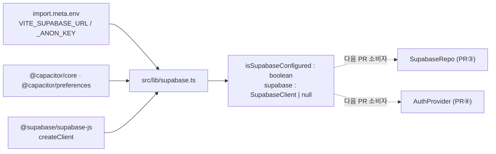

# PR② `feat/supabase-client` — 구현 로그 (implementer)

> 대상: qa-verifier(검증 경계면 "env graceful"), 다음 PR③ 담당.
> 근거 문서: `05_backend_auth_plan.md` §4.2(클라이언트 정본), §8 PR②, §1.2 AC-11, §10 S1·S2, 부록 A·B.
> 검증: `npm run build`(tsc -b → vite build)와 `npm test`(vitest run) 모두 그린(아래 결과).

## 1. 범위 (계획 PR② = 정확히 이만큼)

env 미설정에서도 빌드/테스트가 깨지지 않는 graceful한 Supabase 클라이언트 모듈 + env 타입/예시만 도입.
인증 UI·Repository·스키마·동기화는 본 PR 범위 아님(각각 PR③④⑤).

## 2. 파일 맵

| 구분 | 파일 | 내용 |
|---|---|---|
| 신규 | `src/lib/supabase.ts` | §4.2 정본 그대로. `url`/`anon` = env, `nativeStorage`(Preferences 비동기 어댑터), `isSupabaseConfigured = Boolean(url && anon)`, `supabase = configured ? createClient(...PKCE...) : null` |
| 신규 | `src/lib/__tests__/supabase.test.ts` | `vi.mock('@supabase/supabase-js')`로 createClient 모킹(네트워크 0). env 미설정/설정 두 시나리오(7 테스트) |
| 신규 | `.env.example` | `VITE_SUPABASE_URL=` / `VITE_SUPABASE_ANON_KEY=` + 보안 주석(anon=공개키·RLS가 방어선, `.env` 커밋 금지, service_role 절대 금지) |
| 변경 | `src/vite-env.d.ts` | `ImportMetaEnv`에 `VITE_SUPABASE_URL?: string` / `VITE_SUPABASE_ANON_KEY?: string` + `ImportMeta.env` 선언 추가 |
| 변경 | `package.json` | dep 추가: `@supabase/supabase-js@^2.108.2`, `@capacitor/preferences@^8.0.1` |

미변경 확인: `.gitignore`는 이미 `.env`/`.env.*` 제외 + `!.env.example` 허용(수정 불필요). 실제 `.env` 파일은 생성하지 않음.

## 3. 핵심 결정

- **env 부재 = 로컬 전용 모드(AC-11)**: 모듈 최상단에서 env를 읽되, 빈 문자열도 미설정으로 취급(`Boolean(url && anon)`). 미설정이면 `createClient`를 호출조차 하지 않고 `supabase = null` → import 시점 크래시 없음.
- **타입 안전성 유지(우회 금지)**: 도메인/소비자에 노출되는 export 타입은 정직하게 `SupabaseClient | null`. 유일한 `as never`는 §4.2 정본대로 `storage` 옵션에 한정(supabase-js의 storage 타입과 커스텀 비동기 어댑터의 구조적 간극 — 정본이 명시). 그 외 `any`/광역 캐스팅 없음.
- **테스트의 createClient 모킹**: `vi.fn`에 호출 시그니처(`CreateClientArgs` 튜플)를 부여해 `mock.calls[0]`이 타입 안전하게 구조분해되도록 함. 강제 `as` 캐스팅 제거(초기 `tsc -b`가 `[]`→3-tuple 변환을 거부해서 발견 → 시그니처 부여 방식으로 해소).
- **env 시나리오 격리**: 모듈이 import 시점에 env를 1회 평가하므로, 각 테스트는 `vi.stubEnv` + `vi.resetModules` + 동적 `import('../supabase')`로 깨끗한 재평가 강제.
- **PKCE 옵션 검증**: env 설정 케이스에서 `createClient`가 `flowType:'pkce'`, `autoRefreshToken:true`, `persistSession:true`, 비네이티브(테스트=웹)에서 `detectSessionInUrl:true`·`storage:undefined`로 호출됨을 assert.

## 4. 테스트 결과 (실측)

- 신규 단위테스트 `src/lib/__tests__/supabase.test.ts`: **7 passed** (env 미설정 4 + env 설정 3).
  - env 미설정: import 무크래시 / `isSupabaseConfigured===false` / `supabase===null` & `createClient` 미호출 / (url만 있고 anon 없음)=미설정.
  - env 설정: `isSupabaseConfigured===true` / `supabase!==null` / `createClient`가 url·anon·PKCE 옵션으로 1회 호출.
- `npm run build`(env 없이): **그린** — `tsc -b` 통과 + `vite build` 92 modules, `✓ built`.
- `npm test`(env 없이): **그린** — exit 0, 모든 테스트 파일 passed.
  - 주의: 현재 리포에 stale 워크트리 `.claude/worktrees/relaxed-swanson-363852/`가 남아 있어 Vitest 기본 glob이 테스트 트리를 중복 수집함(보고 카운트가 약 2배로 부풀려짐). **본 PR과 무관한 사전 잔여물**이며 정합성에는 영향 없음(중복본도 동일 통과). 별도 정리 대상으로 플래그함.

## 5. 다음 PR 핸드오프

- **PR③ `feat/db-schema-rls`**: 본 PR의 `supabase`(`SupabaseClient | null`)와 `isSupabaseConfigured`를 그대로 소비. `supabaseRepo.ts`는 `if (!supabase) ...`(로컬 전용 모드 분기) 가드 필수 — null 가능성을 좁혀 쓸 것. `mappers.ts`(§2.4)와 함께 load/apply CRUD 구현. `0001_init.sql`(스키마+RLS+handle_new_user)은 사용자가 SQL Editor에 적용(§9.1).
- **PR④ `feat/web-auth-gate`**: `supabase.auth.*` 사용 시 동일하게 null 가드. env 미설정이면 AuthGate가 "백엔드 미설정/게스트" 분기로 폴백(§4.2 주석).
- **사용자 사전 준비물(§9.1)**: Supabase 프로젝트 생성 → Project URL / anon key 발급 → 로컬 `.env`에 `VITE_SUPABASE_URL` / `VITE_SUPABASE_ANON_KEY` 입력(`.env.example` 참고). `.env`는 커밋 금지(이미 ignore됨).
- **경계면 미확정 없음**: 본 PR의 export 계약(`isSupabaseConfigured: boolean`, `supabase: SupabaseClient | null`)은 부록 B "env graceful"과 1:1.

## 6. 엄격 제약 준수 확인

- `src/domain/**`, `src/state/appReducer.ts`, UI(`src/components`·`src/views`), `capacitor.config.ts`, localStorage `cs_*` 키 — **무변경**.
- 새 시크릿/`.env` 커밋 없음. `service_role` 미언급·미사용(anon 공개키 + RLS 방어선 원칙만 `.env.example` 주석에 명시).
