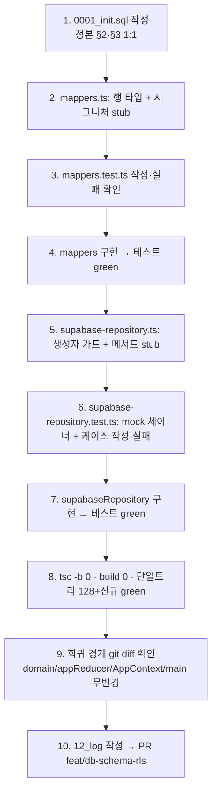

# 설계: PR③ `feat/db-schema-rls` — DB 스키마 + RLS + supabaseRepository (집중 구현 계획)

> 산출물: `_workspace/11_pr_db_schema_rls_plan.md`
> 대상: implementer (즉시 착수), qa-verifier (검증 경계면 B1/B3)
> 정본: `_workspace/05_backend_auth_plan.md` §2·§3·§2.4·§5·§8(PR③)·§10·§11·부록A·B
> 핸드오프 정본: `_workspace/07_pr_repository_abstraction_qa.md` §4.3·§5, `_workspace/10_pr_supabase_client_qa.md`
> 브랜치: `feat/db-schema-rls` (현재). **본 문서는 설계/계획만 — 코드/SQL 작성·git 작업은 implementer 단계.**

## 0. 핵심 결정 요약 (먼저 읽을 것)

PR③은 **서버 측 진실(SQL 스키마+RLS)** 과 **클라이언트 측 비동기 어댑터(supabaseRepository+mappers)** 를 도입하되,
**기존 동기 Repository 인터페이스·AppContext·128 테스트는 일절 건드리지 않는다.** 이것이 회귀 0의 유일한 보장이다.

| # | 결정 | 근거 (핸드오프) |
|---|------|----------------|
| D1 | supabaseRepository는 **독립 비동기 클래스**. 기존 `Repository`(동기) 인터페이스를 **구현하지 않고**, 승급하지도 않는다. | 07 §4.3·§5: "인터페이스 비동기 승급은 PR④/⑤로 이연". AppContext가 동기 `useReducer` init 유지 → 회귀 0. |
| D2 | AppContext/main.tsx/appReducer/UI **배선 없음**. supabaseRepository는 어디에서도 import되지 않는 "고립된" 모듈로 추가(테스트만 소비). | 07 §4.2·§4.3. 배선은 PR④(AuthGate await)·PR⑤(SyncRepo). |
| D3 | `RepoChange`/`actionToChanges`/`memoryRepo` **미도입**. supabaseRepository 입력은 PersistedState/엔티티 배열 기반 per-entity upsert. | 07 §4.2·§5: RepoChange는 PR⑤ 이연. 지금 테스트 가능한 최소 표면만. |
| D4 | `CollectedChord`(id 없음)은 `(user_id, name)` upsert로 처리. **도메인 타입 `src/domain/types.ts` 변경 금지.** | 05 §2.3. 경계면 안정. |
| D5 | RLS 자동검증은 **범위 밖**(라이브 DB 필요). 단위테스트는 supabase-js mock으로 "호출 정확성"만 검증. RLS 실격리(A/B)는 SQL + 수동 체크리스트로 인계. | 05 §11.2, 부록B B1. |
| D6 | `supabase=null`(env 미설정) 시 supabaseRepository 생성자가 **즉시 throw**(명확한 에러). 호출 시점이 아니라 생성 시점 가드. | 05 §4.2 AC-11, 10 B5/B6. |

## 1. 수용 기준 (AC) — `[QA]` = qa-verifier 검증 대상

### 1.1 SQL 마이그레이션
- [ ] **AC-1** `supabase/migrations/0001_init.sql` 단일 파일에 5개 테이블(profiles/grass/journal_entries/drills/collected_chords) + 인덱스 + 전 테이블 RLS enable + select/insert/update/delete 정책 + `handle_new_user` 트리거가 정본 §2·§3과 **1:1**로 들어간다. [QA: SQL 구조 대조]
- [ ] **AC-2** SQL은 `updated_at` 자동갱신 트리거를 **두지 않는다**(정본 §2.2 주의: 클라가 명시 set, LWW 일관). [QA: 트리거 부재]
- [ ] **AC-3** SQL이 Supabase SQL Editor/`db push`에서 오류 없이 실행된다(사용자/CI 수동 — 자동 범위 밖, 체크리스트 §6 인계). [QA: 수동]

### 1.2 mappers (객체 ↔ 행)
- [ ] **AC-4** `grassMapToRows`/`grassRowsToMap` 라운드트립이 동치(`count>0` 필터 — 정본 §2.4). [QA: B3]
- [ ] **AC-5** journal/drill/collected의 행↔객체 매퍼가 snake_case(서버) ↔ camelCase(도메인) 변환을 정확히 수행하고, 도메인 타입을 변형 없이 복원한다. [QA: B3]
- [ ] **AC-6** `CollectedChord`(id 없음)은 행 매핑 시 `name`을 자연키로 쓰고, 매퍼는 도메인 객체에 없는 필드(id/user_id/deleted_at)를 도메인으로 누출시키지 않는다. [QA: B3·D4]

### 1.3 supabaseRepository (비동기 어댑터)
- [ ] **AC-7** `supabase=null`이면 `new SupabaseRepository(null)`(또는 팩토리)가 명확한 메시지로 throw. `supabase≠null`이면 정상 생성. [QA: D6]
- [ ] **AC-8** `loadAll()`이 5개 테이블을 select하고 `deleted_at is null` 필터를 적용하며, 결과를 mappers로 `PersistedState`로 조립해 `Promise<PersistedState>`를 반환한다(mock 검증). [QA: B3]
- [ ] **AC-9** per-entity 저장 메서드가 올바른 테이블/`onConflict`/upsert 페이로드(특히 grass=`user_id,day`, collected=`user_id,name`)와 soft-delete(`update set deleted_at=now()`)를 호출한다(mock 검증). [QA: B3]
- [ ] **AC-10** 모든 쓰기 호출에 `user_id`가 주입되고, 클라이언트가 `updated_at`(ISO)을 명시적으로 set한다(트리거 미사용 전제 — D5/정본 §2.2). [QA: B3]

### 1.4 회귀 (불변)
- [ ] **AC-11** 기존 단위테스트(실측 단일 트리 **128**) 전부 통과. supabaseRepository/mappers 신규 테스트만 증가. [QA: 회귀]
- [ ] **AC-12** `npx tsc -b` 0, `npm run build` 0. 신규 런타임 의존성 0(이미 설치된 `@supabase/supabase-js`만 사용). [QA: 빌드]
- [ ] **AC-13** 변경 셋이 §5 "회귀 경계(변경 금지)"를 침범하지 않는다(domain/appReducer/AppContext/main/UI/capacitor/cs_* 무변경). [QA: 범위 격리]

## 2. 파일 맵

```
신규:
  supabase/migrations/0001_init.sql          # §2 테이블 + 인덱스 + §3 RLS + handle_new_user 트리거 (트리거형 updated_at 미사용)
  src/state/supabase-repository.ts           # SupabaseRepository (독립 비동기 클래스 — Repository 인터페이스 미구현)
  src/state/mappers.ts                       # 행 ↔ 도메인 객체 변환 (순수, React/supabase 무의존)
  src/state/__tests__/mappers.test.ts        # 라운드트립·snake↔camel·collected name 키
  src/state/__tests__/supabase-repository.test.ts  # supabase-js mock으로 호출 정확성 검증
문서:
  _workspace/11_pr_db_schema_rls_plan.md     # 본 문서
  _workspace/12_pr_db_schema_rls_log.md      # (implementer가 작성할 구현 로그)

변경 금지 (회귀 경계 §5):
  src/domain/**                              # CollectedChord 포함 — 절대 변경 금지 (D4)
  src/state/appReducer.ts                    # reducer 순수
  src/state/AppContext.tsx                   # 동기 init 유지 (D1·D2)
  src/state/repository.ts                    # 동기 Repository 인터페이스 — 승급 금지 (D1)
  src/state/local-repository.ts / persist.ts # cs_* 로컬 흐름
  src/main.tsx · src/native.ts · capacitor.config.ts · src/lib/supabase.ts
  package.json / package-lock.json           # 신규 의존성 0 (AC-12)
```

> **명명 컨벤션 확정**: 실제 코드가 케밥케이스 파일명(`local-repository.ts`, `repository.ts`)을 쓰므로 `supabase-repository.ts`·`mappers.ts`로 통일(정본 부록A의 `src/state/repo/supabaseRepo.ts` 경로 대신 **현 컨벤션 우선** — 07 PASS된 디렉토리 구조 유지). 테스트는 기존과 동일하게 `src/state/__tests__/`.

## 3. SQL 구조 요약 (`supabase/migrations/0001_init.sql`)

정본 §2·§3을 그대로 이식한다. implementer는 정본 SQL 블록을 **수치/문구 그대로** 옮기되 아래 순서·불변을 지킨다.

### 3.1 파일 섹션 순서 (멱등·의존성 순)
1. `create table public.profiles ...` (auth.users 1:1, lang check, migrated_at, created/updated_at)
2. `create table public.grass ...` PK `(user_id, day)`, `count >= 0` check, `grass_user_idx`
3. `create table public.journal_entries ...` PK `id uuid`, `entry_date`, `chords text[]`, `deleted_at`, 2개 인덱스
4. `create table public.drills ...` PK `id uuid`, `target between 1 and 40`, `seq jsonb`/`sheet_id`/`time_sig` 슬롯, `deleted_at`, `sort_order`, 인덱스
5. `create table public.collected_chords ...` PK `id uuid`, `frets jsonb`, `chord_key`, `unique (user_id, name)`, `deleted_at`, 인덱스
6. **RLS**: 5개 테이블 각각 `enable row level security` + select/insert/update/delete 정책(`(select auth.uid()) = user_id`; profiles는 `= id`). soft-delete 행도 본인 read/write 허용.
7. `handle_new_user()` (`security definer set search_path = ''`) + `on_auth_user_created` 트리거(가입 시 profiles 자동 생성, `on conflict (id) do nothing`).

### 3.2 SQL 불변 (변경 시 사용자 확인)
- **`updated_at` 자동갱신 트리거 미작성**(D5, 정본 §2.2 주의) — 동기화 LWW가 클라 타임스탬프 기준이어야 일관. SQL에는 컬럼 default `now()`만 두고 BEFORE UPDATE 트리거는 없음.
- RLS 정책은 `to authenticated` + `(select auth.uid())` **서브쿼리 래핑**(플래너 캐싱, 정본 §3).
- 날짜/문자열은 타임존 변환 없이 그대로 저장(`day date`, `entry_date date`는 'YYYY-MM-DD' 키 안정성 — 정본 §2.1).
- PK `id`는 클라 생성 `uuid`(journal/drill/collected). grass는 자연키 `(user_id, day)`.

### 3.3 SQL ↔ 도메인 행 매핑(요약, 정본 §2.3)

| 도메인 (`src/domain/types.ts`) | 서버 컬럼(snake) | 비고 |
|---|---|---|
| `GrassMap[day] = count` | `grass.day`, `grass.count` | 객체 ↔ 행 변환(§4.1) |
| `JournalEntry.date` | `journal_entries.entry_date` | 나머지 동명(title/minutes/notes), `chords text[]` |
| `Drill.sheetId/timeSig` | `drills.sheet_id/time_sig` | `seq jsonb`, `sort_order`(목록 순서) |
| `CollectedChord.key` | `collected_chords.chord_key` | **id 없음 → name 자연키**, `frets jsonb` |
| `lang` | `profiles.lang` | 스칼라 |

## 4. mappers 시그니처 (`src/state/mappers.ts`)

순수 함수만. `supabase-js`·React 무의존(테스트 1급). 서버 행 타입은 mappers 내부에 로컬 인터페이스로 선언(도메인 타입 오염 방지, D4).

```typescript
import type {
  CollectedChord, Drill, GrassMap, JournalEntry,
} from '../domain/types';
import type { Lang } from './repository';

// ── 서버 행 타입 (이 모듈 로컬 — 도메인에 누출 금지) ──
export interface GrassRow      { user_id: string; day: string; count: number; updated_at: string; }
export interface JournalRow    { id: string; user_id: string; entry_date: string; title: string;
                                 minutes: number; chords: string[]; notes: string;
                                 deleted_at: string | null; updated_at: string; }
export interface DrillRow      { id: string; user_id: string; title: string; target: number; count: number;
                                 seq: Drill['seq'] | null; sheet_id: string | null; time_sig: string | null;
                                 sort_order: number; deleted_at: string | null; updated_at: string; }
export interface CollectedRow  { id: string; user_id: string; name: string; frets: CollectedChord['frets'];
                                 chord_key: string; deleted_at: string | null; updated_at: string; }
export interface ProfileRow    { id: string; lang: Lang; migrated_at: string | null;
                                 created_at: string; updated_at: string; }

// ── grass: 객체 ↔ 행 (정본 §2.4 그대로) ──
export function grassMapToRows(map: GrassMap, userId: string, updatedAt: string): GrassRow[];
export function grassRowsToMap(rows: GrassRow[]): GrassMap;          // count>0만

// ── journal ──
export function journalToRow(e: JournalEntry, userId: string, updatedAt: string): Omit<JournalRow, 'deleted_at'>;
export function rowToJournal(r: JournalRow): JournalEntry;          // entry_date→date, deleted_at/user_id 제거

// ── drill ──
export function drillToRow(d: Drill, userId: string, updatedAt: string, sortOrder: number): Omit<DrillRow, 'deleted_at'>;
export function rowToDrill(r: DrillRow): Drill;                     // sheet_id→sheetId, time_sig→timeSig, seq/null→undefined

// ── collected (id 없음 — name 자연키, D4) ──
export function collectedToRow(c: CollectedChord, userId: string, updatedAt: string): Omit<CollectedRow, 'id' | 'deleted_at'>;
export function rowToCollected(r: CollectedRow): CollectedChord;    // chord_key→key, id/user_id 제거
```

### 4.1 매핑 규칙 (구현·검증 불변)
- `grassRowsToMap`: `count > 0` 행만 맵에 포함(seed/도메인 일관 — 정본 §2.4).
- `rowToDrill`: `sheet_id===null → sheetId 미설정(undefined)`, `seq===null → undefined`. 도메인의 옵셔널 필드는 `null`이 아니라 **부재(undefined)** 로 복원(타입 `Drill.seq?`/`sheetId?`/`timeSig?`).
- `rowToCollected`: 도메인 `CollectedChord{name,frets,key}`만 복원. `id`/`user_id`/`deleted_at`/`chord_key`→`key` 외 누출 0.
- `*ToRow`: 클라가 `updated_at`(ISO 문자열, `new Date().toISOString()`)과 `user_id`를 **명시 주입**(D5/AC-10). `deleted_at`은 insert/upsert 페이로드에 미포함(soft-delete는 별도 update 경로 §4.2).
- `collectedToRow`는 `id`를 만들지 않는다 — 서버 `(user_id,name)` upsert가 PK를 자체 관리(`on conflict (user_id,name) do update`). id 컬럼은 서버 default 또는 마이그레이션 시 발급(클라 무관, D4).

## 5. supabaseRepository 시그니처 (`src/state/supabase-repository.ts`)

**독립 비동기 클래스. 기존 `Repository` 인터페이스를 implements 하지 않는다**(D1 — 동기 시그니처와 충돌 회피). 메서드 표면은 PersistedState 로드 + per-entity 비동기 쓰기로 한정(D3 — RepoChange 미도입).

```typescript
import type { SupabaseClient } from '@supabase/supabase-js';
import type {
  CollectedChord, Drill, GrassMap, JournalEntry,
} from '../domain/types';
import type { Lang, PersistedState } from './...';  // PersistedState는 persist.ts, Lang은 repository.ts

export class SupabaseRepository {
  /**
   * @param client supabase 클라이언트. null이면 생성자에서 즉시 throw (D6/AC-7).
   * @param userId 인증된 사용자 id. 모든 행 쓰기에 user_id로 주입.
   */
  constructor(client: SupabaseClient | null, userId: string);

  // ── 일괄 로드 (PR④/⑤ AuthGate가 await — 본 PR은 테스트만 소비) ──
  /** 5개 테이블 select(+ deleted_at is null) → mappers로 PersistedState 조립. */
  loadAll(): Promise<PersistedState>;

  // ── per-entity 쓰기 (멱등 upsert; 입력은 도메인 객체/배열) ──
  saveGrass(map: GrassMap): Promise<void>;              // grassMapToRows → upsert(onConflict 'user_id,day')
  upsertJournal(entry: JournalEntry): Promise<void>;    // journalToRow → upsert(onConflict 'id')
  deleteJournal(id: string): Promise<void>;             // update set deleted_at=now() where id,user_id (soft)
  upsertDrill(drill: Drill, sortOrder: number): Promise<void>; // upsert(onConflict 'id')
  deleteDrill(id: string): Promise<void>;               // soft-delete
  upsertCollected(chord: CollectedChord): Promise<void>;// upsert(onConflict 'user_id,name')  ← D4
  deleteCollected(name: string): Promise<void>;         // soft-delete by (user_id,name)  ← D4
  setLang(lang: Lang): Promise<void>;                   // profiles upsert(onConflict 'id') {id:userId, lang, updated_at}
}
```

### 5.1 구현 불변
- **생성자 가드(D6/AC-7)**: `if (!client) throw new Error('SupabaseRepository requires a configured Supabase client (env missing)')`. → 호출자(PR④/⑤)가 `isSupabaseConfigured` 분기로 LocalRepository 폴백을 선택하게 한다(본 PR은 배선 안 함, D2).
- **user_id 스코프**: 모든 select/upsert/update에 `user_id`(생성자 인자) 주입. RLS와 이중 방어. select는 `.eq('user_id', userId)` 불필요(RLS가 거름)하나, **명시적 `.is('deleted_at', null)` 필터는 필수**(soft-delete 행 제외 — AC-8).
- **updated_at**: 매 쓰기마다 `new Date().toISOString()` 1회 산출해 mappers에 전달(트리거 미사용, D5/AC-10).
- **soft-delete**: `delete*`는 물리 삭제가 아니라 `update({ deleted_at: now, updated_at: now })`(정본 §2.1 tombstone — 기기간 삭제 전파 준비). 본 PR은 전파 로직 없음, 컬럼 세팅만.
- **반환**: 쓰기 메서드는 `Promise<void>`. supabase 에러는 throw(호출자=PR⑤ 큐가 재시도 책임). 본 PR은 "호출이 정확한가"만 테스트.
- **PersistedState 조립**: `loadAll`은 5개 쿼리를 `Promise.all`로 병렬 → 각 결과를 mappers로 변환 → `{ grass, journal, collected, drills, lang }` 반환. 빈 결과 시 빈 컬렉션/`lang` 기본('ko'). seed는 **적용하지 않음**(신규 유저 빈 상태 — 정본 §7.1; LocalRepository와 다른 정책).

## 6. 테스트 목록

### 6.1 `mappers.test.ts` (순수, mock 불필요)
1. `grassMapToRows`→`grassRowsToMap` 라운드트립 동치(여러 day).
2. `grassRowsToMap`이 `count===0` 행을 제외(정본 §2.4 필터).
3. `grassMapToRows`가 모든 행에 동일 `user_id`·`updated_at` 부여.
4. `journalToRow`/`rowToJournal` 라운드트립: `date↔entry_date`, `chords text[]` 보존, `user_id`/`deleted_at` 비누출.
5. `drillToRow`/`rowToDrill`: `sheetId↔sheet_id`/`timeSig↔time_sig`, `sheet_id=null→sheetId undefined`, `seq=null→undefined`, `sort_order` 주입.
6. `collectedToRow`/`rowToCollected`: `key↔chord_key`, **id 미생성**, `frets jsonb` 보존, 도메인엔 `name/frets/key`만(D4).
7. `*ToRow`가 도메인 객체를 변형하지 않음(입력 불변성 — frozen/copy 확인).

### 6.2 `supabase-repository.test.ts` (supabase-js mock)
> mock 전략: `vi.fn()` 기반 fluent 체이너(`from().select().is()` / `from().upsert()` / `from().update().eq()`)를 직접 만들어 `SupabaseClient`로 캐스팅 주입(PR② `supabase.test.ts`의 `vi.mock`/`vi.fn` 패턴 재사용). 실제 네트워크 0.

8. 생성자: `client=null` → throw(D6/AC-7).
9. 생성자: `client≠null` → 정상 인스턴스.
10. `loadAll`: 5개 테이블 각각 `from(<table>).select(...).is('deleted_at', null)` 호출됨(grass는 deleted_at 없으니 `.is` 생략 — 테이블별 차이 명시 검증). 반환이 `PersistedState` shape.
11. `loadAll`: mock이 행 배열 반환 시 mappers 경유로 도메인 객체 복원(예: journal `entry_date`→`date`).
12. `loadAll`: 빈 테이블 → 빈 컬렉션 + `lang='ko'`(seed 미적용, 정본 §7.1).
13. `saveGrass`: `from('grass').upsert(rows, { onConflict: 'user_id,day' })` 호출, rows에 `user_id`/`updated_at` 포함.
14. `upsertJournal`: `from('journal_entries').upsert(row, { onConflict: 'id' })`, `entry_date` 포함.
15. `deleteJournal`: `from('journal_entries').update({ deleted_at: <iso>, updated_at: <iso> }).eq('id', id).eq('user_id', uid)` (soft-delete).
16. `upsertDrill`: `onConflict 'id'` + `sort_order` 포함.
17. `deleteDrill`: soft-delete 경로.
18. `upsertCollected`: `from('collected_chords').upsert(row, { onConflict: 'user_id,name' })`, id 미포함(D4).
19. `deleteCollected`: `update deleted_at ... .eq('user_id',uid).eq('name',name)`(name 자연키, D4).
20. `setLang`: `from('profiles').upsert({ id: uid, lang, updated_at }, { onConflict: 'id' })`.
21. 쓰기 메서드가 supabase 에러(`{ error }`) 반환 시 reject/throw(호출자 재시도 위임).

### 6.3 회귀 가드 (재실행, 신규 코드 무관)
- `npx vitest run` 단일 트리 → 기존 **128** 통과 + 신규 14개(±) 추가. (워크트리 중복 카운트는 환경 이슈 — 10 N2, `--exclude '**/.claude/**'`로 단일 트리 실측.)
- `npx tsc -b` 0, `npm run build` 0.

### 6.4 RLS는 단위테스트로 검증하지 않음 (범위 밖 — §7로 인계)
mock은 클라이언트 호출만 본다. RLS는 **서버에서 강제**되므로 mock으로 검증 불가. A/B 격리·default-deny는 §7 라이브 체크리스트.

## 7. 검증 경계면 (qa-verifier 체크리스트)

### B1 — RLS (라이브 DB, **자동 범위 밖** — SQL + 수동 체크리스트로 인계)
> 정본 §3·§11.2·부록B B1. 단위테스트 불가(서버 강제). 사용자/CI가 라이브 Supabase에 `0001_init.sql` 적용 후 수동 또는 supabase-js 통합 스크립트로 검증.

| 테이블 | A(본인) | B(타인) 기대 |
|---|---|---|
| profiles/grass/journal_entries/drills/collected_chords | insert/select/update/delete 자기 행 성공 | A 행 select **0건** · update/delete **영향 0행** · insert(user_id=A) **거부(RLS 위반)** |

체크리스트 항목:
- [ ] 전 테이블 `rowsecurity = true`(`select relname,relrowsecurity from pg_class ...`).
- [ ] 정책 부재 테이블 없음(RLS enable + 정책 0 = default deny이면 본인도 막힘 → 정책 존재 확인).
- [ ] 신규 가입 시 `profiles` 행 자동 생성(`handle_new_user` 동작).
- [ ] anon 키만으로 미인증 select 시 0건(authenticated 정책이라 미인증 차단).

### B3 — Repository 계약 (supabaseRepository) — **단위테스트로 자동 검증**
| 항목 | 생산자 | 소비자 | 계약 |
|---|---|---|---|
| loadAll | supabaseRepository | (PR④/⑤ AuthGate) | 5테이블 select + deleted_at 필터 → `PersistedState`. mappers 경유 도메인 복원 |
| per-entity 쓰기 | supabaseRepository | Supabase | 올바른 테이블·onConflict·soft-delete·user_id/updated_at 주입 |
| mappers | mappers.ts | supabaseRepository | 행↔도메인 라운드트립, snake↔camel, collected name 키, count>0 필터 |
| env 가드 | supabaseRepository 생성자 | (호출자) | client=null → throw(D6) |

> B3는 07에서 LocalRepository로 PASS된 경계면의 **supabaseRepository 확장**. 이번엔 supabase-js mock 기준.

## 8. 회귀 분석 (변경 금지 경계 — AC-13)

| 경계 | 영향 | 보장 |
|---|---|---|
| `src/domain/**` | 0 | supabaseRepository/mappers는 도메인 타입을 **import만** 함. `CollectedChord` 등 무수정(D4). `git diff --name-only -- src/domain/` 빈 출력 기대. |
| `appReducer.ts` | 0 | 미참조. reducer 순수성 보존(07 §2 동치). |
| `AppContext.tsx` | 0 | supabaseRepository를 import하지 않음(D2). 동기 `useReducer` init·`saveAll` effect 유지 → 128 테스트 회귀 0. |
| `repository.ts`(동기 인터페이스) | 0 | 승급/구현하지 않음(D1). supabaseRepository는 별개 클래스. |
| `local-repository.ts`/`persist.ts`/`cs_*` | 0 | 로컬 흐름 무변경. |
| `main.tsx`/`native.ts`/`capacitor.config.ts` | 0 | 배선 없음(D2). |
| `src/lib/supabase.ts` | 0 | 읽기만(타입). PR② 산출물 무수정. |
| `package.json` | 0 | 신규 의존성 0(이미 `@supabase/supabase-js` 설치 — 10 B8). |

**회귀 0의 메커니즘**: supabaseRepository는 *어디에서도 import되지 않는 고립 모듈*이다(테스트 제외). 따라서 런타임 그래프·번들 진입점에 들어가지 않아(트리셰이킹) 앱 동작·기존 테스트에 영향이 원천적으로 없다. 이것이 D1·D2의 핵심 가치.

## 9. PR④/⑤ 핸드오프 (본 PR이 의도적으로 남기는 것)

| 이연 항목 | 대상 PR | 본 PR의 준비 |
|---|---|---|
| `Repository` 인터페이스 **비동기 승급**(`loadAll(): Promise<PersistedState>`) + AppContext 비동기 초기화(AuthGate await·스플래시) | PR④ | supabaseRepository가 이미 `Promise<PersistedState>` 반환 → 승급 시 시그니처 정합. (07 §4.3 핸드오프 이행 준비) |
| supabaseRepository **배선**(AuthGate에서 세션 시 주입, `isSupabaseConfigured` 분기로 Local 폴백) | PR④ | 생성자 가드(D6)가 폴백 분기 신호 제공. |
| `RepoChange` 유니온 + `actionToChanges(action,prev,next)` + `memoryRepo` | PR⑤ | 본 PR은 per-entity 메서드로 분해 → 매퍼가 이 메서드들을 change별로 호출하도록 매핑만 추가하면 됨. |
| **SyncRepo**(오프라인 큐·pull→merge→push·per-day max 머지·멱등) | PR⑤ | supabaseRepository의 upsert는 이미 멱등(onConflict). soft-delete 컬럼 준비됨. mappers의 grass 행 변환 재사용. |
| user-scoped 로컬 키(`cs:{uid}:*`) | PR⑤ | LocalRepository 미변경(07 §5 합의). |
| **마이그레이션 모달**(기존 cs_* → 서버 1회 머지, `profiles.migrated_at`) | PR⑤ | `profiles.migrated_at` 컬럼·`setLang`/profiles upsert 경로 준비됨. |
| RLS **라이브 격리 검증**(A/B, default-deny) | PR④/⑤ 통합 or 사용자 수동 | `0001_init.sql` + §7 B1 체크리스트 인계. |
| `seed` 정책(신규 유저 빈 상태) | PR⑤ | supabaseRepository.loadAll은 seed 미적용(정본 §7.1)으로 이미 정합. |

## 10. 구현 단계 (TDD 순서)



각 단계는 "한 호흡에 구현+테스트" 크기. SQL(1)은 라이브 적용 전이라 테스트 불가 → 구조 대조(AC-1)로 검증, 실행은 §7 수동 체크리스트.

## 11. 미해결/사용자 확인 필요

- **(확인 권장) supabaseRepository가 동기 `Repository`를 implements 하지 않음** → 본 계획은 D1로 "독립 클래스" 확정. 만약 사용자가 PR③에서 인터페이스 비동기 승급까지 원하면 회귀 범위가 AppContext/128테스트로 확대됨 → 핸드오프(07 §4.3·§5)와 충돌. **본 계획은 핸드오프 준수(승급은 PR④).**
- **(정보) RLS 자동 통합테스트 미포함** — 라이브 Supabase 또는 로컬 `supabase start` CI가 없으면 자동화 불가. 본 PR은 SQL + §7 체크리스트로 인계(정본 §11.2와 동일 결정).
- **(정보) 워크트리 중복 테스트 카운트**(10 N2) — 환경 이슈. 검증 시 `--exclude '**/.claude/**'`로 단일 트리(128) 실측 권장. 본 PR 결함 아님.
