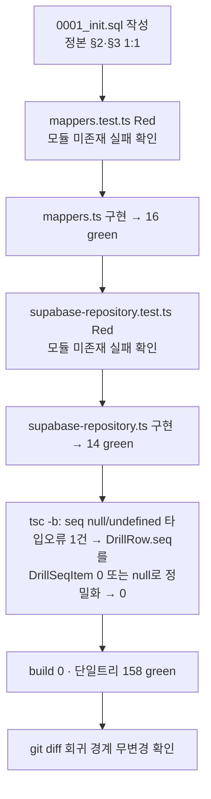

# 구현 로그: PR③ `feat/db-schema-rls` — DB 스키마 + RLS + supabaseRepository

> 산출물: `_workspace/12_pr_db_schema_rls_log.md`
> 정본: `_workspace/11_pr_db_schema_rls_plan.md`(설계) · `_workspace/05_backend_auth_plan.md`(§2·§3 정본)
> 브랜치: `feat/db-schema-rls` · git commit/push 미수행(사용자 승인 대기)
> 방식: TDD(Red → 최소구현 → Green → 리팩터). 계획 §10 10단계 순서 준수.

## 1. 결과 요약

PR③ 계획의 5개 신규 파일을 TDD로 구현했다. 회귀 0(기존 128 → 158, 신규 30 추가).
`npx tsc -b` 0, `npm run build` 0, 단일 트리 테스트 158/158 green. 신규 런타임 의존성 0.
변경 금지 경계(domain/appReducer/AppContext/repository/local-repository/persist/main/native/capacitor/supabase.ts/package.json/UI) **무수정**(`git diff --name-only HEAD` 빈 출력).

## 2. 파일 맵 (전부 신규 — 기존 파일 0개 수정)

| 파일 | 역할 | 비고 |
|------|------|------|
| `supabase/migrations/0001_init.sql` | 5개 테이블 + 인덱스 + 전 테이블 RLS + `handle_new_user` 트리거 | 정본 §2·§3 1:1 이식. `updated_at` 자동갱신 트리거 **미작성**(AC-2). |
| `src/state/mappers.ts` | 순수 행↔도메인 매퍼 + 서버 행 타입(로컬) | React/supabase 무의존. snake↔camel, grass count>0 필터, collected name 자연키. |
| `src/state/supabase-repository.ts` | `SupabaseRepository` 독립 비동기 클래스 | 동기 `Repository` 인터페이스 **미구현/미승급**(D1). 고립 모듈(앱 미import, D2). |
| `src/state/__tests__/mappers.test.ts` | 매퍼 단위테스트 16케이스 | 라운드트립·snake↔camel·count>0·null↔undefined·name키·입력 불변성. |
| `src/state/__tests__/supabase-repository.test.ts` | 리포지토리 단위테스트 14케이스 | supabase-js fluent mock 체이너 자작. 생성자 가드·loadAll 필터·per-entity upsert/soft-delete·에러 전파. |

## 3. 단계별 진행(TDD)



리팩터 1건: `tsc -b`가 `mappers.ts`의 `rowToDrill`에서 `r.seq` possibly undefined(TS18048)를 잡았다.
원인은 `DrillRow.seq: Drill['seq'] | null`인데 `Drill['seq']`가 `DrillSeqItem[] | undefined`(옵셔널)라 `!== null` 가드가 `undefined`를 못 거른 것.
서버 컬럼은 `null | 배열`이지 `undefined`가 아니므로 `DrillRow.seq`를 `DrillSeqItem[] | null`로 정밀화해 해결(타입 우회·캐스팅 없음). 테스트 영향 0.

## 4. 핵심 결정 이행(D1~D6)

| # | 결정 | 구현 반영 |
|---|------|----------|
| D1 | 동기 인터페이스 미승급 — 독립 비동기 클래스 | `SupabaseRepository`는 `implements Repository` 안 함. `loadAll(): Promise<PersistedState>`, 쓰기 `Promise<void>`. |
| D2 | 앱 배선 없음(고립 모듈) | 어디에서도 import 안 됨(테스트만 소비). `npm run build`가 `92 modules transformed`로 동일 — 번들 무진입 확인. |
| D3 | RepoChange/actionToChanges 미도입 | per-entity 메서드(`saveGrass`/`upsertJournal`/`deleteJournal`/`upsertDrill`/`deleteDrill`/`upsertCollected`/`deleteCollected`/`setLang`)만. |
| D4 | CollectedChord(id 없음) → (user_id,name) | `collectedToRow`가 id 미생성. upsert `onConflict: 'user_id,name'`. `deleteCollected(name)` soft-delete. |
| D5 | updated_at 클라 명시 set(트리거 미사용) | SQL에 BEFORE UPDATE 트리거 없음. 매 쓰기 `new Date().toISOString()` 1회 산출해 주입. |
| D6 | client=null 생성자 throw | `constructor`에서 `if (!client) throw`. mock 테스트로 검증. |

## 5. 수용 기준 대조

| AC | 상태 | 근거 |
|----|------|------|
| AC-1 SQL 5테이블+인덱스+RLS+트리거 1:1 | 충족 | `0001_init.sql` 정본 §2·§3 이식. [QA: SQL 구조 대조 — B1] |
| AC-2 updated_at 자동갱신 트리거 부재 | 충족 | SQL에 `touch_updated_at` 트리거 미작성(컬럼 default now()만). |
| AC-3 SQL 라이브 실행 | 범위 밖(수동) | §7 B1 체크리스트로 인계(라이브 Supabase 필요). |
| AC-4 grass 라운드트립(count>0) | 충족 | `mappers.test.ts` 라운드트립·필터 케이스. |
| AC-5 snake↔camel 정확 | 충족 | journal/drill/collected 매퍼 테스트. |
| AC-6 collected name 자연키·id 비누출 | 충족 | `rowToCollected`가 name/frets/key만 복원(키 정렬 검증). |
| AC-7 client=null throw / ≠null 정상 | 충족 | 생성자 가드 2케이스. |
| AC-8 loadAll select+deleted_at 필터 | 충족 | journal/drill/collected `.is('deleted_at', null)`, grass 미적용 검증. |
| AC-9 per-entity onConflict/soft-delete | 충족 | upsert onConflict(grass=user_id,day, collected=user_id,name) + update deleted_at. |
| AC-10 user_id/updated_at 명시 주입 | 충족 | 모든 쓰기 페이로드에 user_id·updated_at(ISO) 포함 검증. |
| AC-11 기존 128 회귀 0 | 충족 | 단일 트리 158 = 128 + 신규 30. |
| AC-12 tsc 0·build 0·신규 의존성 0 | 충족 | `@supabase/supabase-js ^2.108.2` 기설치, package.json 무변경. |
| AC-13 회귀 경계 무침범 | 충족 | `git diff --name-only HEAD` 빈 출력, forbidden 경계 무수정. |

## 6. 검증 출력(실측)

```txt
npx tsc -b            → (출력 없음) 0
npm run build         → ✓ built in 3.19s (92 modules transformed)
vitest run --exclude '**/.claude/**'
                      → Test Files 19 passed (19) · Tests 158 passed (158)
                        (mappers 16 + supabase-repository 14 = 신규 30, baseline 128)
git diff --name-only HEAD     → (빈 출력 — 추적 파일 무수정)
git ls-files --others src supabase →
  src/state/mappers.ts
  src/state/supabase-repository.ts
  src/state/__tests__/mappers.test.ts
  src/state/__tests__/supabase-repository.test.ts
  supabase/migrations/0001_init.sql
```

> 워크트리 중복 카운트(`.claude/worktrees`)는 환경 이슈(10 N2). `--exclude '**/.claude/**'`로 단일 트리 158 실측.

## 7. RLS는 자동 검증 범위 밖(SQL + 수동 체크리스트로 인계)

단위테스트(supabase-js mock)는 "올바른 테이블/필터/onConflict/soft-delete 호출"만 검증한다(mock은 서버 정책을 못 봄).
실제 RLS 격리(유저 A/B), default-deny, `handle_new_user` 자동생성은 라이브 Supabase가 필요 → qa-verifier가 B1 수동 체크리스트로 인계.

B1 체크리스트(라이브 적용 후):
- [ ] 전 테이블 `relrowsecurity = true`(`select relname, relrowsecurity from pg_class ...`).
- [ ] 5개 테이블 각각 정책 존재(RLS enable + 정책 0 = 본인도 막힘 → 정책 존재 확인).
- [ ] 유저 A/B: A는 자기 행 CRUD 성공 · B는 A 행 select 0건, update/delete 영향 0행, insert(user_id=A) 거부.
- [ ] 신규 가입 시 `profiles` 행 자동 생성(`handle_new_user`).
- [ ] anon(미인증) select 0건(authenticated 정책).

## 8. PR④/⑤ 핸드오프(본 PR이 의도적으로 남긴 것)

| 이연 항목 | 대상 PR | 준비 상태 |
|-----------|---------|----------|
| `Repository` 인터페이스 비동기 승급 + AppContext 비동기 init(AuthGate await) | PR④ | `SupabaseRepository.loadAll`이 이미 `Promise<PersistedState>` → 승급 시 시그니처 정합. |
| supabaseRepository 배선(AuthGate 세션 주입, `isSupabaseConfigured` 분기 Local 폴백) | PR④ | 생성자 가드(D6)가 폴백 분기 신호 제공. |
| `RepoChange` 유니온 + `actionToChanges` + `memoryRepo` | PR⑤ | per-entity 메서드로 분해됨 → change별 메서드 매핑만 추가하면 됨. |
| SyncRepo(오프라인 큐·pull→merge→push·per-day max·멱등) | PR⑤ | upsert 멱등(onConflict), soft-delete 컬럼 준비, grass 행 변환 재사용. |
| user-scoped 로컬 키(`cs:{uid}:*`) | PR⑤ | LocalRepository 미변경(07 §5 합의). |
| 마이그레이션 모달(`profiles.migrated_at`) | PR⑤ | `migrated_at` 컬럼 + `setLang`/profiles upsert 경로 준비. |
| RLS 라이브 격리(A/B, default-deny) | PR④/⑤ 통합 or 사용자 수동 | `0001_init.sql` + §7 B1 체크리스트 인계. |
| seed 정책(신규 유저 빈 상태) | PR⑤ | `loadAll`이 seed 미적용(정본 §7.1)으로 정합. |

## 9. 잔여 리스크 / 사용자 확인 필요

- (정보) RLS 자동 통합테스트 미포함 — 라이브 Supabase/로컬 `supabase start` CI 부재 시 자동화 불가. §7 체크리스트로 인계(정본 §11.2 동일 결정).
- (정보) `loadAll`은 profiles 행이 없으면 `lang='ko'` 기본. profiles 자동 생성은 `handle_new_user` 트리거에 의존(라이브 검증 필요).
- (확인 권장) SQL 적용은 사용자가 Supabase SQL Editor/`db push`로 1회 수행(§7 B1 선행 조건).
